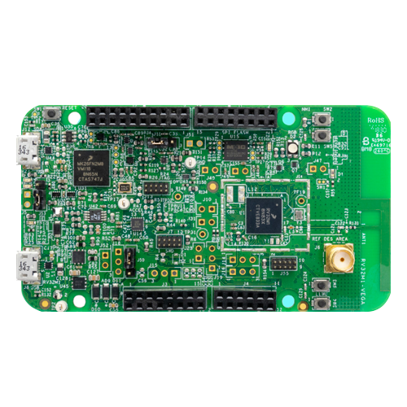

<h1>
    RISC-V Embedded Systems Training 
    VEGA edition 
    <small style="opacity: 0.5;">BTA Design Services</small> 
    <small style="opacity: 0.5;">Between Layers</small>
</h1>

## Overview

TBD

## What will you learn?

The goal of these sessions is to teach you the following:

* How to setup a modern containerized embedded systems development environment
* The basics of RISC-V firmware development
  - Focus will be on the [OpenISA VEGAboard (RV32M1-VEGA)](https://github.com/open-isa-org/open-isa.org) development board
* Simulating hardware using [Renode](https://renode.io/)
* The basics of real-time operating systems (RTOS) and [Zephyr](https://www.zephyrproject.org/)
<!--* If time permits, a quick tour of how the [Rust](https://rust-lang.org/) programming language can be used for firmware development and its potential advantages-->

In the end, the hope is that you gain fundamental generalizable knowledge relating to the development of firmware for microcontroller-based systems.

## Development board giveaways

In addition to the above, we'll be giving away up to **15** VEGAboards for **free** to participants throughout the sessions.
Make sure to attend!

    

## Training schedule and agenda

* **Location:** TBD
* **Times:**
  - Day TBD: time TBD

## Contact information

**Instructors:**

* Alfredo Herrera | `aherrera (at) alean-tec.com`
* Yusef Karim     | `yusef (at) betweenlayers.io`
* Mathieu Gagnon  | `TBD (at) TBD`
